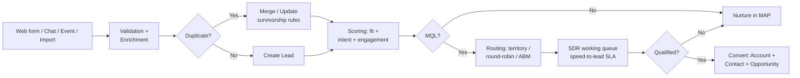
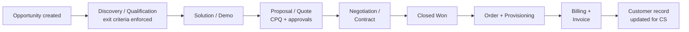

# 03 - Data Flow Reference Architecture

Reference diagrams for how data should move through a SaaS GTM stack. Rendered with Mermaid.

## Lead flow: first touch to working

Key design decisions in this flow:

- Enrichment happens **before** scoring and routing. Routing on unenriched data is random with extra steps.
- Duplicates are resolved **before** creation, not cleaned up after.
- The nurture loop is explicit. Disqualified does not mean deleted.

## Opportunity flow: pipeline to revenue

The handoff that breaks most often is F to G: sales marks closed-won, but the order details (products, terms, start date) are incomplete. Fix it with required closed-won fields that the provisioning system actually consumes.

## Integration patterns

| Pattern | Use when | Example |
|---------|----------|---------|
| Native connector | A first-party sync exists and field mapping is simple | MAP to CRM lead sync |
| iPaaS (Workato, MuleSoft, etc.) | 3+ systems, transformations, error handling needed | Enrichment waterfall, custom routing |
| Event bus / webhooks | Real-time matters (speed-to-lead, chat) | Form fill to Slack alert + task creation |
| Warehouse reverse-ETL | The warehouse is the modeled truth for scores/segments | Propensity scores written back to CRM |

Rules:

1. **One writer per field.** If two systems write to `Lead.Status`, you do not have automation, you have a race condition.
2. **Sync errors go to a queue with an owner**, not to an inbox nobody reads.
3. **Document the contract**: object, direction, frequency, field map, conflict rule. A sync nobody documented is a sync nobody can fix.

## Identity resolution

The unglamorous core of the whole architecture: deciding that `j.smith@acme.com`, `John Smith` from the webinar list, and the chat visitor from acme.com are one person at one account. Get this wrong and scoring double-counts, routing misfires, and attribution lies. Invest here before buying more engagement tools.
